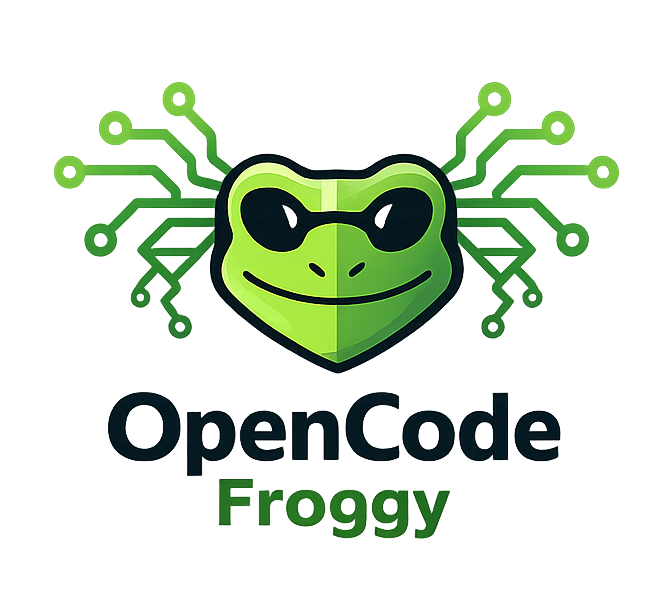

<p align="center">
  
</p>

<p align="center">
  <a href="https://github.com/smartfrog/opencode-froggy/actions"></a>
  <a href="https://www.npmjs.com/package/opencode-froggy"></a>
</p>

OpenCode plugin providing hooks, specialized agents (architect, doc-writer, rubber-duck, partner, code-reviewer, code-simplifier), skills (ask-questions-if-underspecified, tdd), and tools (gitingest, pdf-to-markdown, blockchain queries, agent-promote).

---

## Table of Contents

- [Installation](#installation)
- [Commands](#commands)
- [Agents](#agents)
- [Skills](#skills)
  - [Overview](#overview)
  - [Available Skills](#available-skills)
  - [Discovery Locations](#discovery-locations)
  - [Creating a Skill](#creating-a-skill)
  - [Automatic Activation](#automatic-activation)
- [Tools](#tools)
  - [gitingest](#gitingest)
  - [prompt-session](#prompt-session)
  - [list-child-sessions](#list-child-sessions)
  - [pdf-to-markdown](#pdf-to-markdown)
  - [agent-promote](#agent-promote)
  - [Blockchain](#blockchain)
    - [Configuration](#configuration)
    - [eth-transaction](#eth-transaction)
    - [eth-address-balance](#eth-address-balance)
    - [eth-address-txs](#eth-address-txs)
    - [eth-token-transfers](#eth-token-transfers)
- [Hooks](#hooks)
  - [Configuration Locations](#configuration-locations)
  - [Configuration File Format](#configuration-file-format)
  - [Supported Events](#supported-events)
  - [Conditions](#conditions)
  - [Supported Actions](#supported-actions)
  - [Execution Behavior](#execution-behavior)
  - [Example Hook Configurations](#example-hook-configurations)
- [Configuration Options](#configuration-options)
- [License](#license)

---

## Installation

### From npm (recommended)

Add the plugin to your OpenCode configuration file (`opencode.json`):

```json
{
  "$schema": "https://opencode.ai/config.json",
  "plugin": ["opencode-froggy"]
}
```

### From local files

Alternatively, clone or copy the plugin files to one of these directories:

- **Project-local**: `.opencode/plugin/opencode-froggy/`
- **Global**: `~/.config/opencode/plugin/opencode-froggy/`

---

## Commands

| Command | Description | Agent |
|---------|-------------|-------|
| `/agent-promote <name> [grade]` | Promote an agent to primary (default) or specify grade: `subagent`, `primary`, `all` | - |
| `/agent-demote <name>` | Demote an agent to subagent | - |
| `/commit-push` | Stage, commit, and push changes with user confirmation | `build` |
| `/diff-summary [source] [target]` | Show working tree changes or diff between branches | - |
| `/doc-changes` | Update documentation based on uncommitted changes (new features only) | `doc-writer` |
| `/review-changes` | Review uncommitted changes (staged, unstaged, untracked) | `code-reviewer` |
| `/review-pr <source> <target>` | Review diff from source branch into target branch | `code-reviewer` |
| `/send-to [agent] <message>` | Send a message to a child session (subagent) to continue the conversation | - |
| `/simplify-changes` | Simplify uncommitted changes (staged, unstaged, untracked) | `code-simplifier` |
| `/tests-coverage` | Run the full test suite with coverage report and suggest fixes for failures | `build` |

### /diff-summary

The `/diff-summary` command supports two modes:

**Working tree mode** (no parameters):
```bash
/diff-summary
```
Shows staged changes, unstaged changes, and untracked file contents.

**Branch comparison mode** (with parameters):
```bash
# Compare a branch with the current branch (HEAD)
/diff-summary feature-branch

# Compare two specific branches
/diff-summary feature-branch main
```
Shows stats overview, commits, files changed, and full diff between branches.

---

## Agents

| Agent | Mode | Description |
|-------|------|-------------|
| `architect` | subagent | Strategic technical advisor providing high-leverage guidance on architecture, code structure, and complex engineering trade-offs. Read-only. |
| `doc-writer` | subagent | Technical writer that crafts clear, comprehensive documentation (README, API docs, architecture docs, user guides). |
| `code-reviewer` | subagent | Read-only code review agent for quality, correctness, security, and maintainability feedback. |
| `code-simplifier` | subagent | Simplifies recently modified code for clarity and maintainability while strictly preserving behavior. |
| `partner` | subagent | Strategic ideation partner that breaks frames, expands solution spaces, and surfaces non-obvious strategic options. Read-only. |
| `rubber-duck` | subagent | Strategic thinking partner for exploratory dialogue. Challenges assumptions, asks pointed questions, and sharpens thinking through conversational friction. Read-only. |

---

## Skills

Skills are contextual instructions loaded on demand via the `skill` tool. The agent invokes `skill({ name: "skill-name" })` to load the instructions when needed.

### Overview

- Skills provide specialized guidance for specific tasks
- Instructions are loaded only when explicitly requested
- Multiple skills can exist with the same name; the highest-priority location wins

### Available Skills

| Skill | Description |
|-------|-------------|
| `ask-questions-if-underspecified` | Clarify requirements before implementing. Use when serious doubts arise. |
| `tdd` | Apply Test-Driven Development workflow for new features and bugfixes. |

#### Example: ask-questions-if-underspecified

**User request:**
> "Add authentication to the API"

**Agent response (after loading the skill):**

The agent recognizes this request has multiple interpretations and uses the `question` tool:

```
┌─ Authentication Approach ────────────────────────────────────────┐
│                                                                  │
│  Which authentication method should be implemented?              │
│                                                                  │
│  ○ JWT tokens (Recommended)                                      │
│  ○ Session-based with cookies                                    │
│  ○ OAuth 2.0 / OpenID Connect                                    │
│  ○ API keys                                                      │
│  ○ Other                                                         │
│                                                                  │
└──────────────────────────────────────────────────────────────────┘
```

After the user selects "JWT tokens", the agent confirms:

> "I'll add JWT-based authentication to the API endpoints using the existing Express middleware pattern. Success = all `/api/*` routes require a valid token, with a `/auth/login` endpoint for token generation."

Then implementation begins.

#### Example: tdd

**User request:**
> "Add a function to calculate the total price with tax"

**Agent response (after loading the skill):**

The agent follows the TDD workflow:

1. **Requirement Synthesis:**
> "I'll create a function that calculates total price with tax. It should accept a price and tax rate, returning the total."

2. **Test Specification:**
```typescript
describe("calculateTotalWithTax", () => {
  it("should add tax to the base price", () => {
    expect(calculateTotalWithTax(100, 0.2)).toBe(120)
  })

  it("should handle zero tax rate", () => {
    expect(calculateTotalWithTax(100, 0)).toBe(100)
  })
})
```

3. **Implementation:**
```typescript
function calculateTotalWithTax(price: number, taxRate: number): number {
  return price * (1 + taxRate)
}
```

The tests are written first (red), then the minimal implementation to pass them (green).

### Discovery Locations

Skills are discovered from the following locations, in order of increasing priority:

| Priority | Scope | Location |
|----------|-------|----------|
| 1 (lowest) | plugin | `<plugin>/skill/` |
| 2 | global | `~/.config/opencode/skill/` |
| 3 (highest) | project | `<project>/.opencode/skill/` |

If multiple skills share the same name, the one from the highest-priority location takes precedence.

### Creating a Skill

Each skill lives in its own directory with a `SKILL.md` file:

```
skill/
└── my-skill/
    └── SKILL.md
```

The `SKILL.md` file uses YAML frontmatter for metadata:

```markdown
---
name: my-skill
description: Short description of the skill (required)
use_when: >
  Condition for automatic activation (optional).
---

# Detailed Instructions

Markdown content with step-by-step guidance...
```

#### Frontmatter Fields

| Field | Required | Description |
|-------|----------|-------------|
| `name` | Yes | Unique identifier for the skill |
| `description` | Yes | Short description (displayed in skill listings) |
| `use_when` | No | Condition for automatic activation |

A skill without `name` or `description` will be ignored.

### Automatic Activation

If a skill defines `use_when`, a directive is injected into the system prompt:

```
MANDATORY: Call skill({ name: "my-skill" }) <use_when content>
```

This instructs the agent to load the skill when the specified condition is met.

**What is injected:**
- The skill `name`
- The `use_when` text (normalized: multiple spaces collapsed to single space)

**What is NOT injected:**
- The `description`
- The markdown content (loaded only when the skill is invoked)

---

## Tools

### gitingest

Fetch a GitHub repository's full content via gitingest.com. Returns summary, directory tree, and file contents optimized for LLM analysis. Use when you need to understand an external repository's structure or code.

#### Parameters

| Parameter | Type | Required | Default | Description |
|-----------|------|----------|---------|-------------|
| `url` | `string` | Yes | - | The GitHub repository URL to fetch |
| `maxFileSize` | `number` | No | `50000` | Maximum file size in bytes to include |
| `pattern` | `string` | No | `""` | Glob pattern to filter files (e.g., `*.ts`, `src/**/*.py`) |
| `patternType` | `"include"` \| `"exclude"` | No | `"exclude"` | Whether to include or exclude files matching the pattern |

#### Usage Examples

```typescript
// Fetch entire repository
gitingest({ url: "https://github.com/user/repo" })

// Only TypeScript files
gitingest({ 
  url: "https://github.com/user/repo",
  pattern: "*.ts",
  patternType: "include"
})

// Exclude test files
gitingest({
  url: "https://github.com/user/repo", 
  pattern: "*.test.ts",
  patternType: "exclude"
})

// Increase max file size to 100KB
gitingest({
  url: "https://github.com/user/repo",
  maxFileSize: 100000
})
```

#### Limitations

- Content is truncated to 300k characters (server-side limit from gitingest.com)
- For large repositories, use pattern filtering to focus on relevant files
- The `maxFileSize` parameter controls individual file size, not total output size

---

### prompt-session

Send a message to a child session (subagent) to continue the conversation. Useful for iterating with subagents without creating new sessions.

#### Parameters

| Parameter | Type | Required | Default | Description |
|-----------|------|----------|---------|-------------|
| `message` | `string` | Yes | - | The message to send to the child session |
| `sessionId` | `string` | No | - | The child session ID to target. If omitted, targets the last child session. |

#### Usage Examples

```typescript
// Send a message to the last child session
promptSession({ message: "Please also add unit tests for the new function" })

// Send a message to a specific child session
promptSession({
  message: "Can you clarify the error handling approach?",
  sessionId: "abc123"
})
```

#### Behavior

- If `sessionId` is not provided, the tool automatically targets the most recently created child session
- Returns the text response from the child session
- Returns an error message if no child session exists for the current session

---

### list-child-sessions

List all child sessions (subagents) of the current session. Useful for finding specific sessions to target with `prompt-session`.

#### Parameters

This tool takes no parameters.

#### Usage Examples

```typescript
// List all child sessions
listChildSessions()
```

#### Output

Returns a formatted list of child sessions with:
- Session ID
- Session title
- Created and updated timestamps

Example output:
```
Child sessions (2):

1. [abc123] Code Review Session
   Created: 2024-01-15T10:30:00Z | Updated: 2024-01-15T10:35:00Z

2. [def456] Architecture Discussion
   Created: 2024-01-15T11:00:00Z | Updated: 2024-01-15T11:15:00Z
```

---

### pdf-to-markdown

Convert a text-based PDF into enriched Markdown (headings, paragraphs, lists). Returns Markdown as plain text.

#### Parameters

| Parameter | Type | Required | Default | Description |
|-----------|------|----------|---------|-------------|
| `filePath` | `string` | Yes | - | Absolute path to the PDF file to convert |
| `maxPages` | `number` | No | All pages | Maximum number of pages to convert (positive integer) |

#### Usage Examples

```typescript
// Convert an entire PDF
pdfToMarkdown({ filePath: "/path/to/file.pdf" })

// Convert the first 3 pages
pdfToMarkdown({
  filePath: "/path/to/file.pdf",
  maxPages: 3
})
```

#### Notes

- The conversion extracts text content; image-only PDFs may return empty output.
- `maxPages` is capped at the document's total page count.

---

### agent-promote

Promote an agent to primary (default) or specify a grade.

#### Parameters

| Parameter | Type | Required | Description |
|-----------|------|----------|-------------|
| `name` | `string` | Yes | Name of the plugin agent (e.g., `rubber-duck`, `architect`) |
| `grade` | `string` | No | Target type: `subagent`, `primary`, or `all` (default: `primary`) |

#### Grade Types

| Grade | Effect |
|-------|--------|
| `subagent` | Available only as a subagent |
| `primary` | Appears in Tab selection for direct use |
| `all` | Available both as primary and subagent |

#### Usage Examples

```bash
# Promote rubber-duck to primary (default)
/agent-promote rubber-duck

# Promote with explicit grade
/agent-promote architect all

# Demote back to subagent
/agent-demote rubber-duck
```

#### Notes

- Only agents from this plugin can be promoted (see [Agents](#agents) table)
- Changes persist in memory until OpenCode restarts
- After promotion, use `Tab` or `<leader>a` to select the agent

---

### Blockchain

Tools for querying Ethereum and EVM-compatible blockchains via Etherscan APIs.

All blockchain tools support multiple chains via the `chainId` parameter:

| Chain ID | Network |
|----------|---------|
| `1` | Ethereum (default) |
| `137` | Polygon |
| `56` | BSC |
| `42161` | Arbitrum |
| `10` | Optimism |
| `8453` | Base |
| `43114` | Avalanche |
| `250` | Fantom |
| `324` | zkSync |

#### Configuration

The blockchain tools use Etherscan-compatible APIs. An API key is optional but recommended.

**Environment Variable:**

| Variable | Required | Description |
|----------|----------|-------------|
| `ETHERSCAN_API_KEY` | No | API key for Etherscan and compatible explorers |

**Without an API key:** Requests are rate-limited (typically 1 request per 5 seconds).

**With an API key:** Higher rate limits and more reliable access.

**Getting an API key:**

1. Create a free account at [etherscan.io](https://etherscan.io/register)
2. Navigate to API Keys in your account settings
3. Generate a new API key

**Setting the environment variable:**

```bash
export ETHERSCAN_API_KEY="your-api-key-here"
```

#### eth-transaction

Get Ethereum transaction details by transaction hash. Returns status, block, addresses, gas costs in JSON format. Use optional parameters to include internal transactions, token transfers, and decoded event logs.

##### Parameters

| Parameter | Type | Required | Default | Description |
|-----------|------|----------|---------|-------------|
| `hash` | `string` | Yes | - | Transaction hash (0x...) |
| `chainId` | `string` | No | `"1"` | Chain ID (see table above) |
| `includeInternalTxs` | `boolean` | No | `false` | Include internal transactions (ETH transfers between contracts) |
| `includeTokenTransfers` | `boolean` | No | `false` | Include ERC-20 token transfers |
| `decodeLogs` | `boolean` | No | `false` | Decode event logs (Transfer, Approval, Deposit, Withdrawal) |

##### Usage Examples

```typescript
// Get basic transaction details on Ethereum mainnet
ethTransaction({ hash: "0x123abc..." })

// Get transaction on Polygon
ethTransaction({ 
  hash: "0x123abc...",
  chainId: "137"
})

// Get transaction with internal transactions and token transfers
ethTransaction({ 
  hash: "0x123abc...",
  includeInternalTxs: true,
  includeTokenTransfers: true
})

// Get full transaction details with decoded event logs
ethTransaction({ 
  hash: "0x123abc...",
  includeInternalTxs: true,
  includeTokenTransfers: true,
  decodeLogs: true
})
```

##### Output Structure

The tool returns JSON with labeled addresses (contract names resolved via Etherscan):

```json
{
  "hash": "0x123...",
  "status": "success",
  "block": 12345678,
  "from": { "address": "0xabc...", "label": "Uniswap V3: Router" },
  "to": { "address": "0xdef...", "label": "WETH" },
  "value": "0",
  "gas": { "used": 150000, "price": "20000000000", "cost": "0.003" }
}
```

With `includeInternalTxs: true`:
```json
{
  "internalTransactions": [
    {
      "from": { "address": "0x...", "label": "Uniswap V3: Router" },
      "to": { "address": "0x...", "label": null },
      "value": "1.5",
      "type": "call"
    }
  ]
}
```

With `includeTokenTransfers: true`:
```json
{
  "tokenTransfers": [
    {
      "token": { "address": "0x...", "name": "Wrapped Ether", "symbol": "WETH", "decimals": 18 },
      "from": { "address": "0x...", "label": null },
      "to": { "address": "0x...", "label": "Uniswap V3: Router" },
      "value": "1.5"
    }
  ]
}
```

With `decodeLogs: true`:
```json
{
  "decodedEvents": [
    {
      "name": "Transfer",
      "address": { "address": "0x...", "label": "WETH" },
      "params": { "from": "0x...", "to": "0x...", "value": "1500000000000000000" }
    }
  ],
  "undecodedEventsCount": 2
}
```

##### Supported Decoded Events

| Event | Description |
|-------|-------------|
| `Transfer` | ERC-20 token transfer |
| `Approval` | ERC-20 approval for spending |
| `Deposit` | WETH deposit (ETH → WETH) |
| `Withdrawal` | WETH withdrawal (WETH → ETH) |

#### eth-address-balance

Get the ETH balance of an Ethereum address. Returns balance in both ETH and Wei.

##### Parameters

| Parameter | Type | Required | Default | Description |
|-----------|------|----------|---------|-------------|
| `address` | `string` | Yes | - | Ethereum address (0x...) |
| `chainId` | `string` | No | `"1"` | Chain ID (see table above) |

##### Usage Examples

```typescript
// Get balance on Ethereum mainnet
ethAddressBalance({ address: "0xd8dA6BF26964aF9D7eEd9e03E53415D37aA96045" })

// Get balance on Arbitrum
ethAddressBalance({ 
  address: "0xd8dA6BF26964aF9D7eEd9e03E53415D37aA96045",
  chainId: "42161"
})
```

#### eth-address-txs

List Ethereum transactions for an address. Shows incoming and outgoing transactions with values, timestamps, and status.

##### Parameters

| Parameter | Type | Required | Default | Description |
|-----------|------|----------|---------|-------------|
| `address` | `string` | Yes | - | Ethereum address (0x...) |
| `limit` | `number` | No | `20` | Maximum number of transactions to return |
| `chainId` | `string` | No | `"1"` | Chain ID (see table above) |

##### Usage Examples

```typescript
// List recent transactions on Ethereum mainnet
ethAddressTxs({ address: "0xd8dA6BF26964aF9D7eEd9e03E53415D37aA96045" })

// List last 50 transactions on Base
ethAddressTxs({ 
  address: "0xd8dA6BF26964aF9D7eEd9e03E53415D37aA96045",
  limit: 50,
  chainId: "8453"
})
```

#### eth-token-transfers

List ERC-20 token transfers for an Ethereum address. Shows token names, symbols, values, and transaction details.

##### Parameters

| Parameter | Type | Required | Default | Description |
|-----------|------|----------|---------|-------------|
| `address` | `string` | Yes | - | Ethereum address (0x...) |
| `limit` | `number` | No | `20` | Maximum number of transfers to return |
| `chainId` | `string` | No | `"1"` | Chain ID (see table above) |

##### Usage Examples

```typescript
// List recent token transfers on Ethereum mainnet
ethTokenTransfers({ address: "0xd8dA6BF26964aF9D7eEd9e03E53415D37aA96045" })

// List last 100 token transfers on Optimism
ethTokenTransfers({ 
  address: "0xd8dA6BF26964aF9D7eEd9e03E53415D37aA96045",
  limit: 100,
  chainId: "10"
})
```

---

## Hooks

Hooks run actions on session events. Configuration is loaded from standard OpenCode configuration directories.

### Configuration Locations

Hooks are loaded from these locations (in order, merged together):

| Platform | Global | Project |
|----------|--------|---------|
| Linux | `~/.config/opencode/hook/hooks.md` | `<project>/.opencode/hook/hooks.md` |
| macOS | `~/.config/opencode/hook/hooks.md` | `<project>/.opencode/hook/hooks.md` |
| Windows | `~/.config/opencode/hook/hooks.md` or `%APPDATA%/opencode/hook/hooks.md` | `<project>/.opencode/hook/hooks.md` |

On Windows, `~/.config` is preferred for cross-platform consistency. If hooks exist in `%APPDATA%` but not in `~/.config`, the `%APPDATA%` location is used.

Global hooks run first, then project hooks are added. Hooks from both sources are combined (not overridden).

### Configuration File Format

- YAML frontmatter must include a `hooks` list
- Each hook defines `event`, `actions`, and optional `conditions`
- Hooks for the same event run in declaration order

Example `hooks.md`:

```markdown
---
hooks:
  - event: session.idle
    conditions: [hasCodeChange, isMainSession]
    actions:
      - command: simplify-changes
---
```

### Supported Events

| Event | Description |
|-------|-------------|
| `session.idle` | Emitted when a session becomes idle and has files modified via `write` or `edit` in that session |
| `session.created` | Emitted when a session is created |
| `session.deleted` | Emitted when a session is deleted |
| `tool.before.*` | Emitted before any tool executes. Exit code 2 blocks the tool. |
| `tool.before.<name>` | Emitted before a specific tool (e.g., `tool.before.write`). Exit code 2 blocks the tool. |
| `tool.after.*` | Emitted after any tool executes |
| `tool.after.<name>` | Emitted after a specific tool (e.g., `tool.after.edit`) |

#### Tool Hook Execution Order

1. `tool.before.*` (all tools)
2. `tool.before.<name>` (specific tool)
3. *(tool executes)*
4. `tool.after.*` (all tools)
5. `tool.after.<name>` (specific tool)

#### Blocking Tools with Exit Code 2

For `tool.before.*` and `tool.before.<name>` hooks, a bash action returning exit code 2 will block the tool from executing. The stderr output is displayed to the user as the block reason.

### Conditions

| Condition | Description |
|-----------|-------------|
| `isMainSession` | Run only for the main session (not sub-sessions) |
| `hasCodeChange` | Run only if at least one modified file looks like code |

All listed conditions must pass for the hook to run.

**Code extensions treated as "code":**

`ts`, `tsx`, `js`, `jsx`, `mjs`, `cjs`, `json`, `yml`, `yaml`, `toml`, `css`, `scss`, `sass`, `less`, `html`, `vue`, `svelte`, `go`, `rs`, `c`, `h`, `cpp`, `cc`, `cxx`, `hpp`, `java`, `py`, `rb`, `php`, `sh`, `bash`, `kt`, `kts`, `swift`, `m`, `mm`, `cs`, `fs`, `scala`, `clj`, `hs`, `lua`.

### Supported Actions

#### Command Action

Execute a plugin command.

```yaml
# Short form
- command: simplify-changes

# With arguments
- command:
    name: review-pr
    args: "main feature"
```

If the command exists in config, the plugin reuses its `agent` and `model`.

#### Tool Action

Prompt the session to use a tool with specific arguments.

```yaml
- tool:
    name: bash
    args: { command: "echo done" }
```

#### Bash Action

Execute a shell command directly without involving the LLM. Useful for running linters, formatters, build scripts, or custom automation.

**Configuration:**

```yaml
# Short form
- bash: "npm run lint"

# Long form with custom timeout
- bash:
    command: "$OPENCODE_PROJECT_DIR/.opencode/hooks/init.sh"
    timeout: 30000  # milliseconds (default: 60000)
```

**Environment Variables:**

The plugin injects these variables into the child process environment:

| Variable | Value | Use case |
|----------|-------|----------|
| `OPENCODE_PROJECT_DIR` | Absolute path to the project (e.g., `/home/user/project`) | Reference project files from scripts located elsewhere |
| `OPENCODE_SESSION_ID` | The OpenCode session identifier | Logging, tracing, or conditioning actions based on session |

**Stdin JSON Context:**

The command receives a JSON object via stdin with session context:

```json
{
  "session_id": "abc123",
  "event": "session.idle",
  "cwd": "/path/to/project",
  "files": ["src/index.ts", "src/utils.ts"]
}
```

The `files` array is only present for `session.idle` events and contains paths modified via `write` or `edit`.

For tool hooks (`tool.before.*`, `tool.after.*`), additional fields are provided:

```json
{
  "session_id": "abc123",
  "event": "tool.before.write",
  "cwd": "/path/to/project",
  "tool_name": "write",
  "tool_args": { "filePath": "src/index.ts", "content": "..." }
}
```

**Environment Variables vs Stdin JSON:**

- **Environment variables**: Direct access via `$VAR`, convenient for simple values like paths and IDs
- **Stdin JSON**: Contains richer context (event type, working directory, modified files), requires parsing with `jq` or similar

Both mechanisms are complementary. Use environment variables for quick access to project path and session ID; use stdin JSON when you need event details or the list of modified files.

**Exit Codes:**

| Code | Behavior |
|------|----------|
| `0` | Success, continue to next action |
| `2` | Blocking error, stop remaining actions in this hook |
| Other | Non-blocking error, log warning and continue |

**Result Feedback:**

Bash hook results are automatically sent back to your session:

```
[BASH HOOK ✓] npm run lint
Exit: 0 | Duration: 1234ms
Stdout: All files passed linting
```

The feedback includes a status icon (✓ success, ✗ failure), exit code, execution duration, and stdout/stderr output (truncated to 500 characters). This message appears in your session but does not trigger a response from the assistant.

### Execution Behavior

- Action errors are logged and do not stop later actions
- `session.idle` only fires if files were modified via `write` or `edit`; the session's modified file list is cleared after the hook runs
- The main session is set on `session.created` with no parent, or on the first `session.idle` if needed

### Example Hook Configurations

#### Basic Multi-Hook Setup

```markdown
---
hooks:
  - event: session.idle
    conditions: [hasCodeChange, isMainSession]
    actions:
      - bash: "npm run lint --fix"
      - command: simplify-changes

  - event: session.created
    actions:
      - bash:
          command: "$OPENCODE_PROJECT_DIR/.opencode/hooks/init.sh"
          timeout: 30000
      - command:
          name: review-pr
          args: "main feature"
---
```

#### Simple Lint-on-Idle Hook

```yaml
hooks:
  - event: session.idle
    conditions: [hasCodeChange]
    actions:
      - bash: "npm run lint --fix"
```

#### Custom Initialization Script

`.opencode/hooks/init.sh`:

```bash
#!/bin/bash
set -e

# Read JSON context from stdin
context=$(cat)
session_id=$(echo "$context" | jq -r '.session_id')
event=$(echo "$context" | jq -r '.event')
cwd=$(echo "$context" | jq -r '.cwd')

echo "Session $session_id triggered $event in $cwd"

# Use environment variables
echo "Project: $OPENCODE_PROJECT_DIR"

# Exit 0 for success, 2 to block remaining actions
exit 0
```

#### Conditional Blocking Based on Lint Errors

```bash
#!/bin/bash
# Run linter and block if critical errors found
if ! npm run lint 2>&1 | grep -q "critical"; then
  exit 0  # Success, continue
else
  echo "Critical lint errors found, blocking further actions"
  exit 2  # Block remaining actions
fi
```

#### Block Modifications to Sensitive Files

```yaml
hooks:
  - event: tool.before.write
    actions:
      - bash: |
          file=$(cat | jq -r '.tool_args.filePath // .tool_args.file_path // .tool_args.path')
          if echo "$file" | grep -qE '\.(env|pem|key)$'; then
            echo "Cannot modify sensitive files: $file" >&2
            exit 2
          fi

  - event: tool.before.edit
    actions:
      - bash: |
          file=$(cat | jq -r '.tool_args.filePath // .tool_args.file_path // .tool_args.path')
          if echo "$file" | grep -qE '\.(env|pem|key)$'; then
            echo "Cannot modify sensitive files: $file" >&2
            exit 2
          fi
```

#### Auto-Format TypeScript Files After Write

```yaml
hooks:
  - event: tool.after.write
    actions:
      - bash: |
          file=$(cat | jq -r '.tool_args.filePath // .tool_args.file_path // .tool_args.path')
          if echo "$file" | grep -qE '\.tsx?$'; then
            npx prettier --write "$file"
          fi
```

#### Log All Tool Executions

```yaml
hooks:
  - event: tool.before.*
    actions:
      - bash: |
          context=$(cat)
          tool=$(echo "$context" | jq -r '.tool_name')
          echo "[$(date)] Tool: $tool" >> /tmp/opencode-tools.log
```

---

## Configuration Options

The plugin does not require additional configuration. Agents, commands, and skills are loaded automatically from the `agent/`, `command/`, and `skill/` directories within the plugin. Hooks are loaded from the standard OpenCode configuration directories (see [Hooks](#hooks) section).

### Supported Code File Extensions

The `hasCodeChange` condition checks file extensions against the default set listed in the [Conditions](#conditions) section. Hooks without any conditions still trigger on any modified file paths tracked via `write` or `edit` in the current session.

---

## License

MIT
